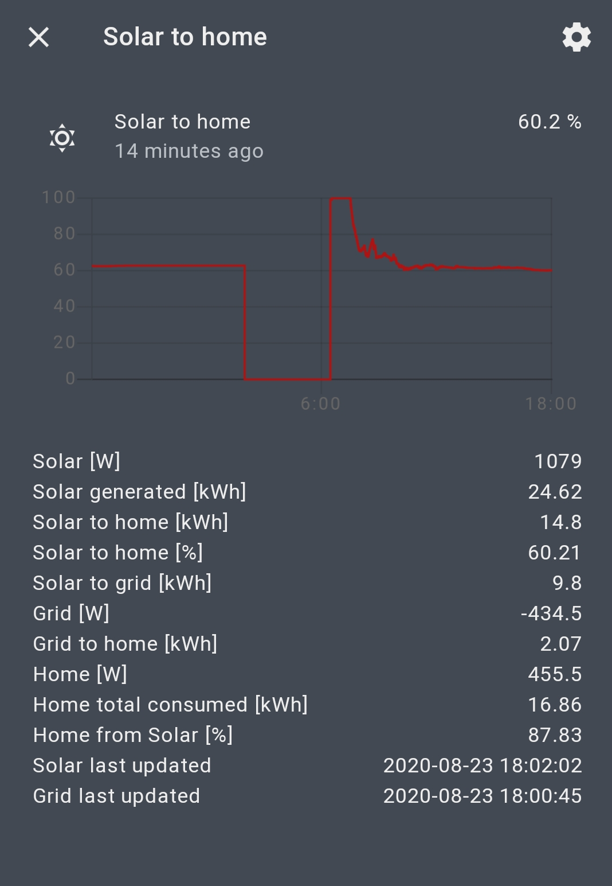

# energy_calc

Adds a sensor to Home Assistant that displays the daily ussage of your solar panels.
The integration requires two sensors: 
1. a sensor that shall provide the current grid power (positiv for "buying power", negatvie if you "sell" power to the grid)
2. the current power of your solar inverter
The integration will consume updates of both entities and integrate the current power to an energy value.

**This component will set up the following platforms.**

Platform | Description
-- | --
`sensor` | Show the percentage of your solar power that is used by your home.




## Features

- Integrated two sensors values: Current grid power [W] / current solar power [W] to energy values [kWh]
- Calucates 8 important values
- Solar [W]: Displays the given solar inverter power sensor value (not caluclated)
- Solar generated [kWh]: The total amount of power that you solar installation provided as of now (resets at midnight)
- Solar to home [kWh]: The amount of solar power that you've consumed yourself
- Solar to home [%]: Same value as percent. 60% means 60% of your solar power is consumed by your home. This is also primary the sensor value!
- Solar to grid [kWh]: Remaining energy from the solar inverter that wasn't consumed by your home and thus fed into the grid
- Grid [W]: Displays the given grid power sensor value (not calculated)
- Grid to home [kWh]: The total amount of power that the net provided to as of now (resets at midnight)
- Home [W]: Current power of the home (can be grid only, solar only or a mixture)
- Home total consumed [kWh]: The total amount of power that your home consumed as of now (resets at midnight)
- Home from solar [%]: The percentage of the total energy that was supplied by your solar installation


# Installation

## HACS

The easiest way to add this to your Homeassistant installation is using [HACS]. 

It's recommended to restart Homeassistent directly after the installation without any change to the Configuration. 
Homeassistent will install the dependencies during the next reboot. After that you can add and check the configuration without error messages. 
This is nothing special to this Integration but the same for all custom components.


## Manual

1. Using the tool of choice open the directory (folder) for your HA configuration (where you find `configuration.yaml`).
2. If you do not have a `custom_components` directory (folder) there, you need to create it.
3. In the `custom_components` directory (folder) create a new folder called `energy_calc`.
4. Download _all_ the files from the `custom_components/energy_calc/` directory (folder) in this repository.
5. Place the files you downloaded in the new directory (folder) you created.
6. Follow the instructions under [Configuration](#Configuration) below.

Using your HA configuration directory (folder) as a starting point you should now also have this:

```text
custom_components/energy_calc/translations/en.json
custom_components/energy_calc/__init__.py
custom_components/energy_calc/manifest.json
custom_components/energy_calc/sensor.py
custom_components/energy_calc/config_flow.py
custom_components/energy_calc/const.py
```

# Setup

All you need to have are two sensor. One for the current grid power [W] and one for the solar power [W].

## Configuration options

Key | Type | Required | Default | Description
-- | -- | -- | -- | --
`name` | `string` | `false` | `None` |  The friendly name of the sensor
`icon` | `string` | `false` | `mdi:weather-sunny` | MDI Icon string, check https://materialdesignicons.com/
`net_id` | `string` | `true` | `None` | The entity id of the sensor that supplies the current grid/net power
`gen_id` | `string` | `true` | `None` | The entity id of the sensor that supplies the current solar power

## GUI configuration 

Config flow is supported and is the prefered way to setup the integration. (No need to restart Home-Assistant)

## Manual configuration 

To enable the sensor, add the following lines to your `configuration.yaml` file and replace the link accordingly:

```yaml
# Example entry for configuration.yaml
sensor:
   - platform: energy_calc
     name: "Solar to home"
     net_id: "sensor.dev37_em_cur"
     gen_id: "sensor.kaco_194"
```
